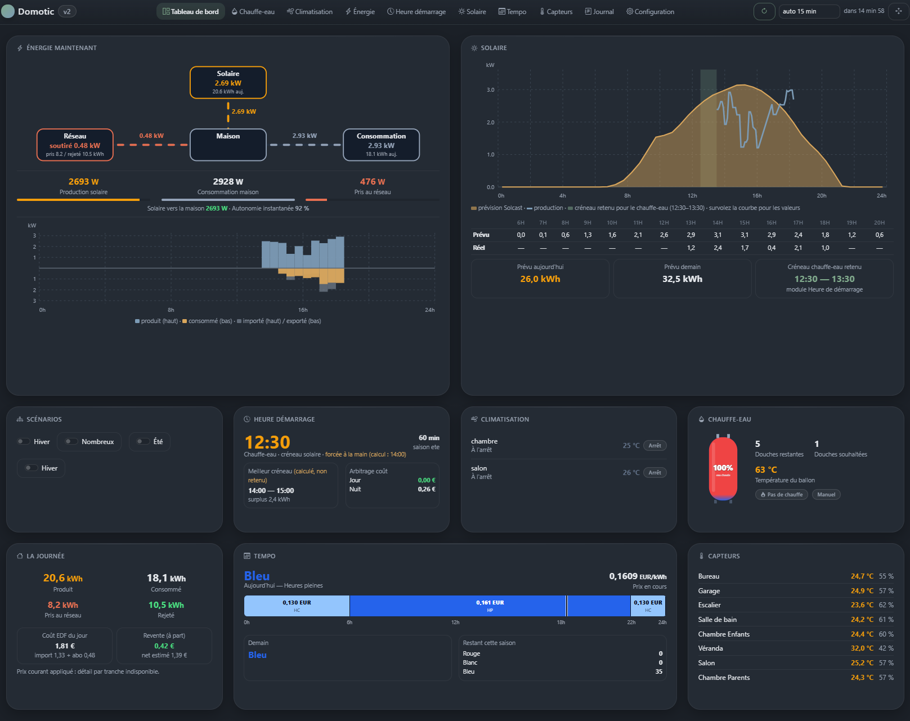

# Homotic

Tableau de bord domestique modulaire, écrit en Django. Il réunit les mesures
de la maison en direct, un éditeur de scénarios d'automatisation, et pilote
les consommations selon la production solaire et les tarifs EDF.


[](LICENSE)



L'idée directrice : **le socle ne connaît aucun équipement**. Ajouter une
capacité — une marque de caméras, un onduleur, un fournisseur de prévisions —
se fait en déposant un répertoire dans `modules/`, sans toucher au reste.
Chaque module déclare ce qu'il expose, et le socle le branche tout seul dans
le tableau de bord, le scheduler et l'éditeur de scénarios.

## Ce que ça fait

- **Tableau de bord** organisable en glisser-déposer : ordre et largeur des
  blocs enregistrés en base, donc identiques depuis le PC et le téléphone.
- **Éditeur de scénarios** par blocs, sans écrire de code : déclencheurs
  (heure fixe, heure calculée, périodique, bouton, switch), conditions avec
  opérateurs et parenthésage, actions, blocs Si/Alors/Sinon et boucles
  imbricables sur trois niveaux.
- **Scheduler** (APScheduler) qui exécute les tâches déclarées par les
  modules, avec une périodicité surchargeable depuis l'interface.
- **Neuf modules livrés** : énergie solaire, prévisions, tarifs Tempo,
  chauffe-eau, climatisation, capteurs, caméras, alarme, et un module de
  calcul qui arbitre l'heure de chauffe du ballon.
- **Exposé sur Internet** : authentification obligatoire par défaut, HTTPS,
  déploiement par systemd et nginx.

## Démarrage rapide

```bash
git clone https://github.com/RomainGuillon/Homotic.git
cd Homotic
python -m venv .venv && source .venv/bin/activate   # Windows : .venv\Scripts\activate
pip install -r requirements.txt
python manage.py migrate
python manage.py createsuperuser
python manage.py runserver 0.0.0.0:8100
```

Puis ouvrir <http://localhost:8100/> et se connecter. L'application est fermée
par défaut : aucune page n'est accessible sans session.

Aucune configuration n'est nécessaire pour démarrer — les clés d'API des
modules se saisissent dans l'interface, et rien n'est stocké dans le dépôt.
Pour une installation exposée sur Internet, voir
[docs/10-mise-en-ligne.md](docs/10-mise-en-ligne.md).

## Documentation

Le [sommaire complet](docs/README.md) couvre l'installation, la prise en main,
les scénarios, les modules livrés, la création d'un module, la référence des
contrats et le dépannage. Trois entrées pour commencer :

- [Prise en main](docs/02-prise-en-main.md) — l'onglet Configuration
- [Créer un module](docs/06-creer-un-module.md) — le contrat, avec un exemple complet
- [Référence des contrats](docs/07-reference-contrats.md) — `conf.py` et services du socle

## Structure

```
Homotic/
├── core/          socle : onglets permanents, scénarios, scheduler, liaisons
├── modules/       un répertoire par module (voir modules/README.md)
├── homotic/       configuration Django (settings, urls)
├── deploiement/   systemd, nginx, script de mise à jour du serveur
├── docs/          documentation
└── manage.py
```

Les modules ne s'appellent jamais entre eux : ils déclarent ce dont ils ont
besoin, et l'utilisateur branche les liaisons dans la configuration — voir
[Liaisons entre modules](docs/09-liaisons-entre-modules.md).

## Écrire un module

```python
from core.services import journal, get_setting, set_setting, get_variable, set_variable

journal("Chauffe-eau démarré", module="chauffe_eau")
set_setting("api_key", "xxx", module="enphase", secret=True)
get_setting("api_key", module="enphase")
```

Un module minimal se résume à un `conf.py` qui déclare son onglet, ses
fonctions de scénario, ses lectures et ses tâches. Le module `modules/exemple/`
sert de squelette.

## Feuille de route

- [x] Socle : onglets, journal, configuration clé/valeur, boutons et switchs
- [x] Contrat de module, détection automatique, activation depuis l'interface
- [x] Scheduler avec périodicités surchargeables
- [x] Éditeur de scénarios : blocs Si, boucles, variables, infos typées
- [x] Liaisons déclaratives entre modules
- [x] Neuf modules : énergie, solaire, tempo, chauffe-eau, clim, capteurs,
      caméras, alarme, heure de démarrage
- [x] Mise en ligne : authentification, HTTPS, systemd, script de déploiement
- [ ] Optimisation automatique (chauffe-eau × production solaire × Tempo)

## Pile technique

Django 5.1+, SQLite en WAL, APScheduler, Bootstrap. Aucun service externe
n'est requis pour faire tourner le socle.

## Licence

[MIT](LICENSE) — Copyright (c) 2026 Romain Guillon.

Homotic est un logiciel libre. Vous pouvez l'utiliser, le modifier, le
redistribuer et le commercialiser. La seule obligation est de conserver la
mention de copyright dans les copies et les travaux dérivés.

Mentions complètes, contributions, composants tiers et sécurité :
[`NOTICE.md`](NOTICE.md).

> **Besoin d'un module sur mesure, d'une mise en production ou d'une
> adaptation professionnelle ?** Le logiciel est libre, l'accompagnement est
> une prestation — voir [`NOTICE.md`](NOTICE.md).

**English —** Homotic is free software under the MIT license. Use, modify,
redistribute and sell it freely; just keep the copyright notice. Custom
modules, deployment and professional adaptation available as paid services —
see [`NOTICE.md`](NOTICE.md).
