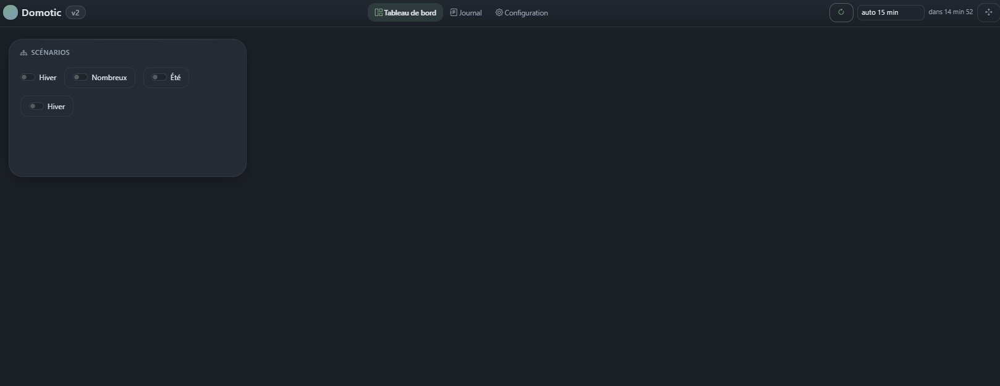

[← Sommaire](README.md)

# 1. Installation

## Prérequis

- **Python 3.10 ou plus** (le projet tourne en 3.14)
- **Windows** pour le poste actuel, mais rien n'est spécifique à Windows
  hormis les commandes ci-dessous
- Accès réseau local aux équipements (passerelle Enphase, prises Tuya…) et
  accès Internet pour les API (Solcast, RTE Tempo, Cozytouch, Hi-Kumo)

## Mise en place

```bat
cd C:\Dev\Homotic
.venv\Scripts\activate
pip install -r requirements.txt
python manage.py migrate
```

`requirements.txt` installe :

| Paquet | Rôle |
| --- | --- |
| `django` | le socle web |
| `requests` | appels HTTP aux API |
| `apscheduler` | **le scheduler** : tâches périodiques et scénarios horaires |
| `pyoverkiz` | chauffe-eau Cozytouch et climatisations Hi-Kumo |

> **APScheduler n'est pas optionnel.** Sans lui, l'application démarre et
> s'affiche normalement, mais **aucun scénario ne se déclenche et aucune
> donnée ne se rafraîchit en arrière-plan**. C'est la panne la plus
> silencieuse du projet : voir [Dépannage](08-depannage.md).

## Démarrage

```bat
cd C:\Dev\Homotic
.venv\Scripts\activate
python manage.py runserver 0.0.0.0:8100
```

Puis ouvrir <http://localhost:8100/>.

L'écoute sur `0.0.0.0` rend l'application accessible depuis les autres
appareils du réseau local (téléphone, tablette) à l'adresse
`http://<ip-du-pc>:8100/`.

Le port 8100 permet de cohabiter avec la v1, qui utilise le port par défaut.



## Ce qui se passe au démarrage

1. Django charge le socle `core` **et les modules activés** — les modules
   cochés dans l'onglet Configuration deviennent des apps Django à part
   entière (voir `homotic/settings.py`).
2. Le **scheduler démarre** et enregistre :
   - les tâches périodiques déclarées par les modules actifs,
   - les scénarios à déclencheur horaire, calculé, périodique ou au changement.
3. Une ligne « Scheduler démarré : N tâche(s), M scénario(s) » est écrite
   dans le **Journal**. Son absence est le signe qu'il n'a pas démarré.

Le scheduler ne démarre **qu'avec `runserver`** : les commandes `migrate`,
`shell` ou `makemigrations` ne le lancent pas, c'est voulu.

## Mise à jour du projet

Après avoir récupéré une nouvelle version du code :

```bat
.venv\Scripts\activate
pip install -r requirements.txt
python manage.py migrate
python manage.py runserver 0.0.0.0:8100
```

`migrate` est nécessaire dès qu'un modèle de données change (nouveau champ
de bloc, nouveau réglage…). En cas de doute, le lancer ne coûte rien : il
ne fait rien s'il n'y a rien à faire.

## Sauvegarde

Tout l'état de l'application tient dans **`db.sqlite3`** : réglages, clés
d'API, contrôles, scénarios, variables, disposition du tableau de bord,
journal. Copier ce fichier suffit à sauvegarder l'installation.

Les clés d'API sont stockées en base et masquées dans l'interface, mais
**pas chiffrées** : le fichier de base mérite le même soin qu'un fichier de
mots de passe.
