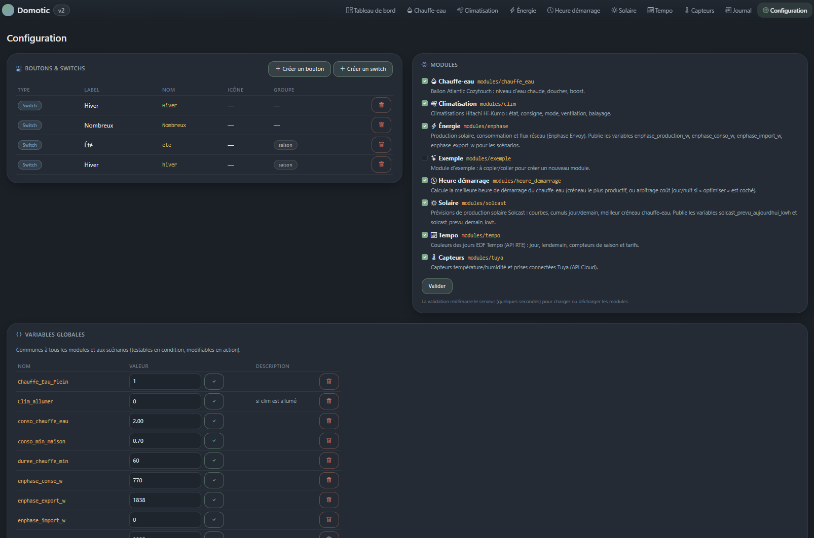
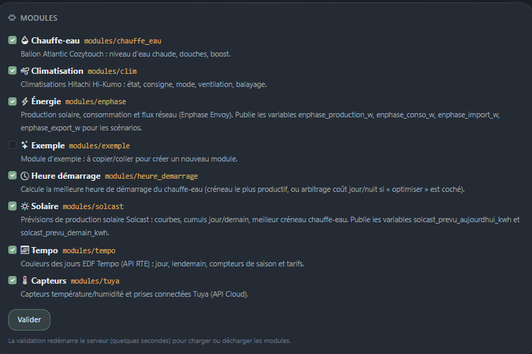
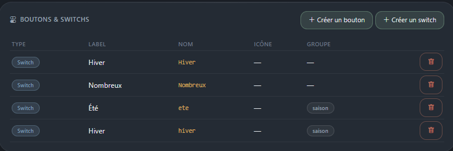
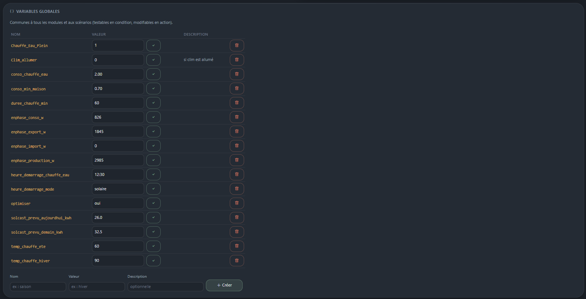
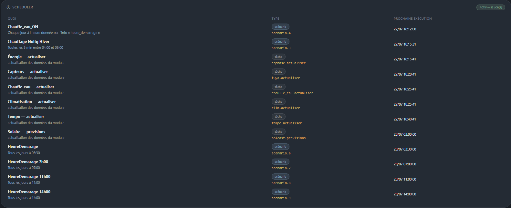
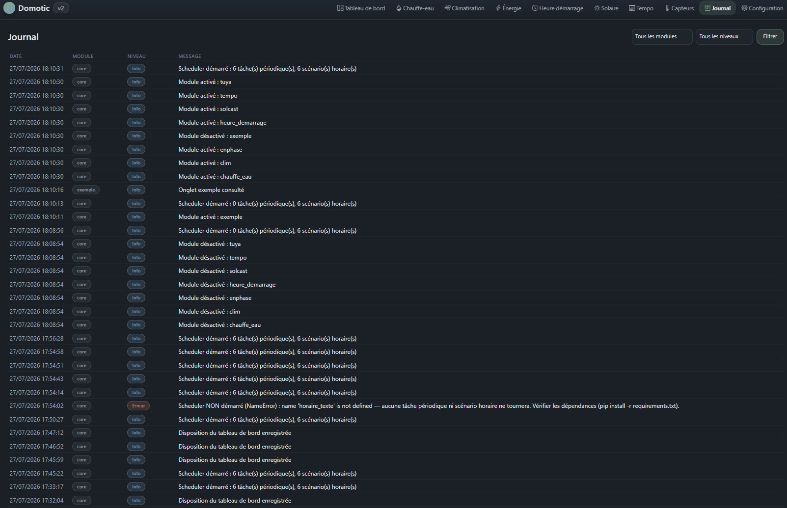

[← Sommaire](README.md)

# 2. Prise en main — l'onglet Configuration

Tout se paramètre depuis l'onglet **Configuration**, organisé en cinq
sections : boutons & switchs, modules, variables globales, scheduler,
scénarios.

## Activer les modules

La section **Modules** liste ce qui est présent dans le répertoire
`modules/`. Cocher un module puis **Valider** :

1. le module est enregistré en base ;
2. le serveur redémarre automatiquement ;
3. son onglet apparaît dans la barre de navigation, et son bloc sur le
   tableau de bord s'il en fournit un.

Décocher puis valider retire l'onglet et le bloc, **sans supprimer les
réglages** du module : le recocher plus tard retrouve la configuration.

Un module dont le `conf.py` est invalide reste affiché avec son message
d'erreur, plutôt que d'empêcher toute l'application de démarrer.

## Boutons poussoirs et switchs

Ce sont les commandes visibles dans le bloc **Scénarios** du tableau de
bord, et les déclencheurs les plus simples pour un scénario.

| Type | Comportement | Usage typique |
| --- | --- | --- |
| **Bouton poussoir** | une impulsion, pas d'état mémorisé | « Lancer la chauffe maintenant » |
| **Switch** | reste ON ou OFF | « Mode Nombreux », « Été / Hiver » |

Un switch peut appartenir à un **groupe exclusif** : activer l'un éteint
automatiquement les autres du groupe. C'est ce qui relie les switchs
« Été » et « Hiver » du module Heure de démarrage.

> Attention aux doublons : le nom interne d'un contrôle est ce que lisent
> les scénarios et les modules. Deux switchs affichant tous deux « Hiver »
> mais nommés `hiver` et `Hiver` sont deux objets différents, et un seul
> sera lu.

## Variables globales

Une variable est une valeur nommée, partagée par tous les modules et tous
les scénarios. Elle est **testable en condition**, **modifiable en action**,
et éditable à la main depuis cette page.

Elles servent à trois choses :

- **publier une mesure** pour les scénarios — les modules alimentent
  `enphase_production_w`, `solcast_prevu_aujourdhui_kwh`… ;
- **mémoriser un état** entre deux exécutions — `Clim_allumer`,
  `Chauffe_Eau_Plein` ;
- **fixer une consigne modifiable sans toucher au code** —
  `heure_demarrage_chauffe_eau`.

Le bouton ✓ à droite d'une variable enregistre la valeur saisie. C'est le
moyen de forcer une valeur à la main, par exemple corriger une heure de
démarrage calculée.

## Scheduler

La carte **Scheduler** est le diagnostic de l'exécution en arrière-plan :

- **actif / à l'arrêt**, avec l'erreur de démarrage le cas échéant ;
- la liste des tâches et scénarios enregistrés, **par ordre de passage**,
  avec leur prochaine exécution.

Les noms affichés sont ceux des scénarios et des modules ; l'identifiant
technique (`scenario.4`, `solcast.previsions`) est rappelé en dessous pour
le dépannage.

Si cette carte affiche « à l'arrêt », **rien ne s'exécute automatiquement** :
commencer par là avant de chercher pourquoi un scénario ne part pas.

## Journal

L'onglet **Journal** enregistre tout ce que fait l'application :
exécutions de scénarios, erreurs d'API, changements de réglages. Il se
filtre par module et par niveau (info, avertissement, erreur).

C'est le premier endroit à consulter quand un comportement surprend : les
scénarios y écrivent leur origine de déclenchement et, en cas d'échec, la
condition qui n'était pas remplie.
