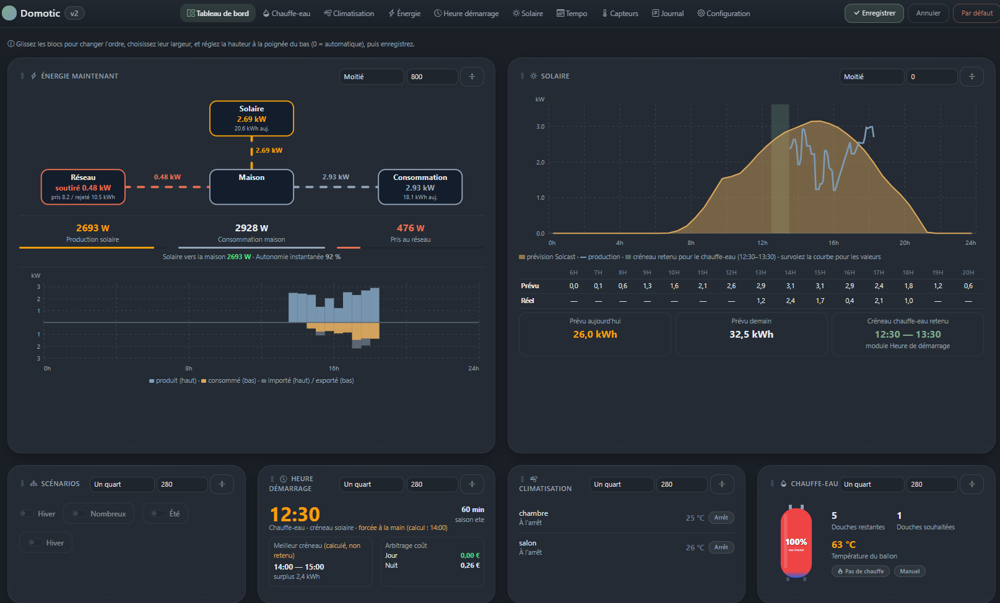

[← Sommaire](README.md)

# 3. Le tableau de bord

Le tableau de bord assemble :

- le bloc **Scénarios** — les boutons poussoirs et switchs créés dans
  Configuration ;
- un ou plusieurs blocs **par module actif** : chaque module décide de ce
  qu'il affiche.

Un module peut fournir plusieurs blocs (le module Énergie en propose deux :
« Énergie maintenant » et « La journée »).

## Barre d'actions

La barre de navigation tient sur **deux lignes** : la marque à gauche et les
onglets centrés sur la première, les icônes d'action sur la seconde. Sur un
écran étroit, la marque passe au-dessus des onglets plutôt que de les
comprimer, et les actions se centrent.

Les commandes du tableau de bord sont ces icônes de la seconde ligne :

| Commande | Effet |
| --- | --- |
| ⟳ | Recharge la page immédiatement |
| `auto N min` | Rafraîchissement automatique, avec compte à rebours |
| ✥ | Bascule en mode **Organiser** |

Le rafraîchissement automatique est un **réglage enregistré en base**, donc
identique depuis le PC et le téléphone. Le compte à rebours se remet à zéro
quand l'onglet passe en arrière-plan, pour ne pas recharger dans la seconde
où l'on y revient.

> Le bouton **Actualiser recharge la page**, il ne relance aucun calcul et
> ne déclenche aucun appel d'API à quota. Il rafraîchit les mesures locales
> (Enphase, Tuya, chauffe-eau). L'heure de démarrage et les prévisions
> solaires ne bougent pas — voir [Scénarios](04-scenarios.md) et
> [Modules livrés](05-modules-livres.md).

## Mode Organiser

En mode Organiser, chaque bloc peut être :

- **déplacé** par glisser-déposer, pour changer l'ordre ;
- **redimensionné en largeur** par le sélecteur : un quart, un tiers,
  moitié, deux tiers, pleine largeur ;
- **redimensionné en hauteur** par la poignée en bas du bloc, ou en tapant
  une valeur en pixels dans le champ.

Le bouton ⤡ à côté du champ remet la hauteur en **automatique**.

Trois précisions sur la hauteur :

- **Automatique (0)** : le bloc prend la hauteur de son contenu, et
  s'aligne sur le plus grand bloc de sa ligne.
- **Hauteur fixe** : le bloc fait exactement cette taille. Plus grand que
  son contenu, il crée de l'espace et permet d'aligner une rangée ; plus
  petit, son contenu défile à l'intérieur.
- Un bloc en hauteur fixe **n'est plus tiré par le plus grand bloc de sa
  ligne** : c'est ce qui permet de reprendre la main sur une rangée
  déséquilibrée.

Le rafraîchissement automatique est **suspendu** en mode Organiser : un
rechargement en plein glisser-déposer ferait perdre la disposition.

**Enregistrer** valide la disposition, **Annuler** revient sans changement,
**Par défaut** efface la disposition personnalisée et revient au placement
d'origine.

## Blocs et modules

Un bloc en erreur n'empêche pas le tableau de bord de s'afficher : le socle
attrape l'exception, écrit la ligne dans le Journal et passe au bloc
suivant. Un bloc absent du tableau de bord alors que le module est actif est
donc souvent une erreur de rendu à chercher dans le Journal.
