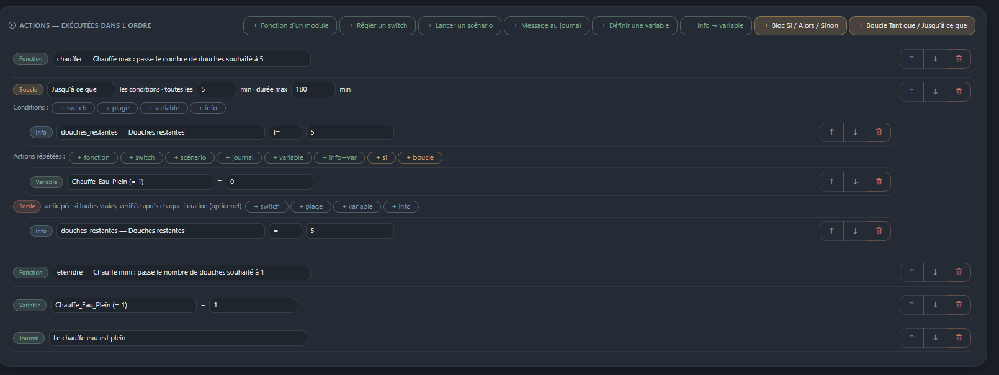
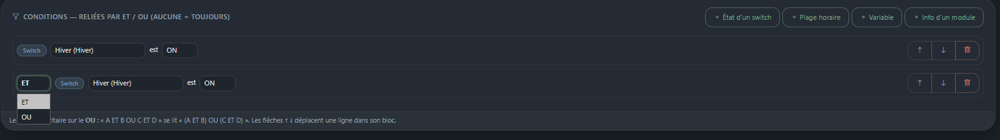

[← Sommaire](README.md)

# 4. Les scénarios

Un scénario, c'est trois choses :

```
DÉCLENCHEUR  →  CONDITIONS  →  ACTIONS
quand ?         si ?            faire quoi ?
```

Il se crée depuis **Configuration → Nouveau scénario**.



## Déclencheurs — quand lancer le scénario ?

| Déclencheur | Quand | Remarques |
| --- | --- | --- |
| **Manuel** | Bouton ▶ Tester, ou appelé par un autre scénario | Le seul qui ne part jamais tout seul |
| **Tous les jours à heure fixe** | À l'heure indiquée | Job cron |
| **Tous les jours à une heure calculée** | À l'heure lue dans une variable ou une info de module | Un seul lancement par jour |
| **Au changement d'une valeur** | Quand une variable ou une info change | Sondage réglable, filtre possible sur la valeur d'arrivée |
| **Toutes les X minutes** | Périodique, avec fenêtre horaire optionnelle | Sert de « tant que » / « jusqu'à ce que » |
| **Appui sur un bouton** | Immédiat | |
| **Bascule d'un switch** | Quand le switch passe à ON ou à OFF | |

### Heure calculée

L'heure est **relue à chaque vérification** dans une variable globale ou une
info de module. Elle peut donc changer dans la journée, mais le scénario ne
part **qu'une fois par jour**.

Un **rattrapage de 10 minutes** est prévu : si la minute exacte est manquée
(serveur occupé, redémarrage, source momentanément illisible), le
déclenchement a quand même lieu dans les 10 minutes qui suivent. Sans lui,
une seule minute ratée annulait la chauffe de la journée. Le délai se règle
avec le réglage `rattrapage_min` du module `scenarios`.

> **Piège** : brancher ce déclencheur sur une info qui **recalcule** à chaque
> lecture donne une heure qui se déplace. Le calcul de l'heure de démarrage
> du chauffe-eau ne retient que les créneaux **à venir** : à 12h30, le
> créneau de 12h30 n'est plus candidat et l'heure recule devant l'horloge.
> Brancher le déclencheur sur une **variable**, alimentée quand on le décide.

### Au changement d'une valeur

Compare la valeur courante à la précédente, mémorisée en base — la
surveillance survit donc à un redémarrage. Trois garde-fous :

- une **source illisible** ne déclenche rien et n'écrase pas la référence :
  une API injoignable ne doit pas passer pour un changement ;
- la **première lecture** sert de référence sans déclencher, sinon chaque
  démarrage du serveur lancerait le scénario ;
- si on modifie le scénario pour surveiller autre chose, la référence
  repart de zéro au lieu de comparer deux valeurs sans rapport.

Le champ « Seulement si la valeur devient » restreint au passage à une
valeur précise (par exemple la couleur Tempo qui passe à `rouge`).

L'intervalle de vérification est réglable, parce qu'une info de module peut
interroger un appareil ou une API.

## Conditions — sous quelles réserves ?

Quatre types : **état d'un switch**, **plage horaire** (dans / hors),
**variable** (avec opérateurs), **info d'un module** (avec opérateurs).

Aucune condition = le scénario s'exécute toujours.

### ET / OU

À partir de la deuxième condition, un sélecteur **ET / OU** relie chaque
ligne à la précédente. Le **ET est prioritaire sur le OU**, comme en
algèbre booléenne :

```
A ET B OU C ET D    se lit    (A ET B) OU (C ET D)
```



Quand aucune branche n'est remplie, le Journal détaille pourquoi chacune a
échoué, au lieu de ne donner qu'une seule raison.

## Actions — que faire ?

| Action | Effet |
| --- | --- |
| **Fonction d'un module** | Appelle une fonction exposée par un module (avec paramètres si elle en déclare) |
| **Régler un switch** | Met un switch à ON ou OFF |
| **Lancer un scénario** | Chaîne vers un autre scénario (3 niveaux maximum) |
| **Message au journal** | Trace une étape |
| **Définir une variable** | Affecte une valeur |
| **Info → variable** | Range le résultat d'une info de module dans une variable |
| **Bloc Si / Alors / Sinon** | Branchement conditionnel |
| **Boucle Tant que / Jusqu'à ce que** | Répétition avec intervalle, durée maximale et sorties anticipées |

Les actions s'exécutent **dans l'ordre**, et s'arrêtent à la première
erreur. Les blocs Si et les boucles s'imbriquent sur **3 niveaux**.

> Une action « régler un switch » **ne redéclenche pas** les scénarios de ce
> switch : c'est délibéré, pour éviter les boucles involontaires. Pour
> chaîner, utiliser explicitement « lancer un scénario ».

## Réorganiser les lignes

Chaque condition et chaque action a des flèches **↑ ↓** pour la déplacer
dans son bloc. Le déplacement reste confiné : une action d'un *Alors* ne
peut pas sauter dans le *Sinon*.

## Tester

Le bouton ▶ de la liste des scénarios exécute le scénario immédiatement,
**conditions comprises**. Le Journal indique le résultat, et pour un échec,
la condition qui a bloqué.

## Exemple complet — chauffe-eau au meilleur moment

Deux scénarios qui se complètent :

**1. Calculer l'heure** (nommé `HeureDemarage`)

- Déclencheur : tous les jours à `03:00` — juste après le rafraîchissement
  Solcast de 3h
- Actions : *Fonction d'un module* → Heure démarrage → `recalculer`

`recalculer` écrit la variable `heure_demarrage_chauffe_eau` et journalise
le détail du calcul (créneau retenu, comparaison des coûts jour/nuit).

**2. Démarrer la chauffe** (nommé `Chauffe_eau_ON`)

- Déclencheur : *heure calculée* → **une variable globale** →
  `heure_demarrage_chauffe_eau`
- Condition (facultative mais recommandée) : info `calcul_du_jour` = `oui`,
  pour ne pas démarrer sur une heure calculée la veille
- Actions : *Fonction d'un module* → Chauffe-eau → `chauffer`

Pour aller plus loin, un troisième scénario au **changement** de
`solcast_prevu_aujourdhui_kwh` peut relancer `recalculer` quand la prévision
du jour évolue nettement.
