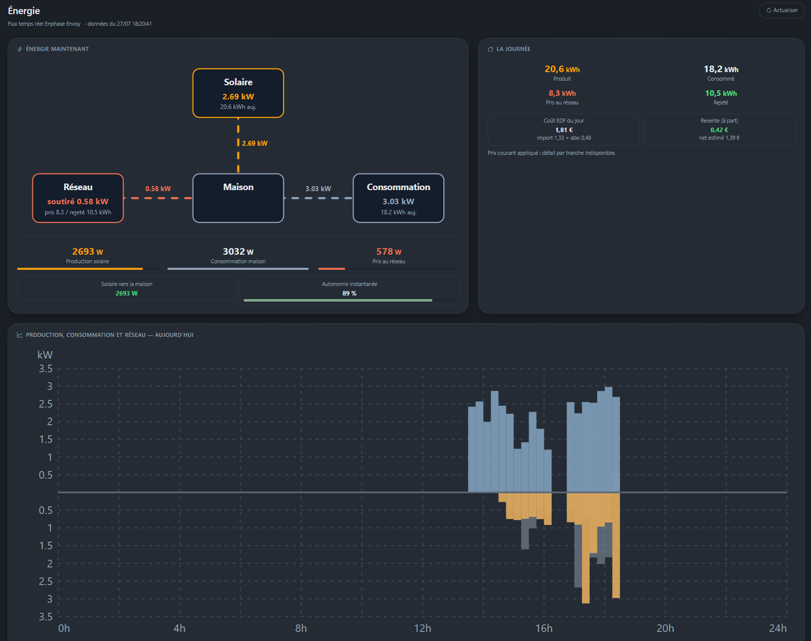
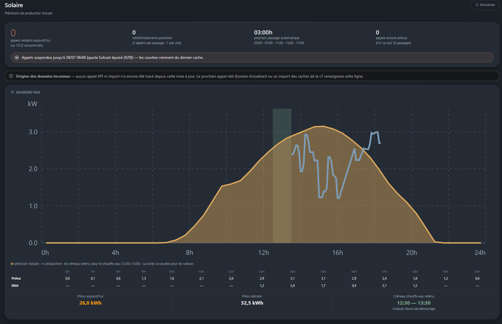
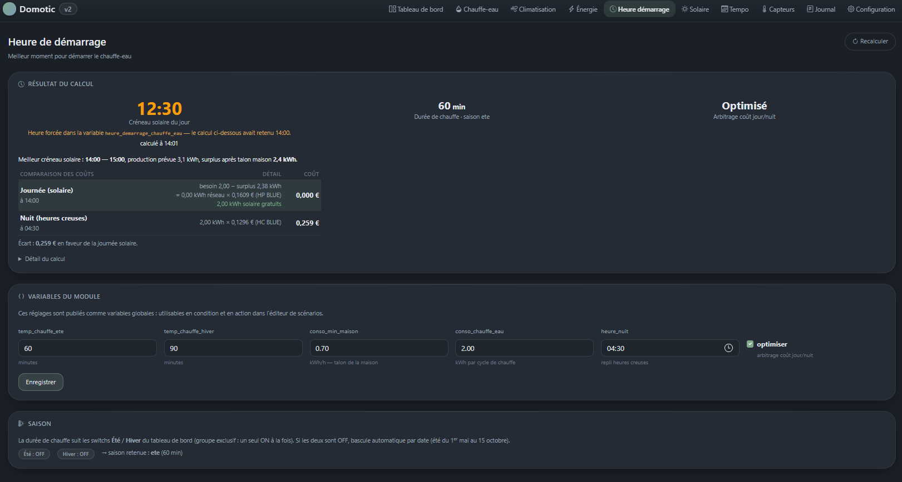

[← Sommaire](README.md)

# 5. Les modules livrés

Chaque module se paramètre dans son propre onglet, section « Paramétrage ».

| Module | Onglet | Ce qu'il apporte |
| --- | --- | --- |
| `chauffe_eau` | Chauffe-eau | Ballon Atlantic via Cozytouch : état, douches restantes, chauffe forcée |
| `clim` | Climatisation | Climatisations Hitachi Hi-Kumo : marche/arrêt, mode, consigne |
| `enphase` | Énergie | Passerelle Envoy locale : production, consommation, réseau, courbe du jour |
| `solcast` | Solaire | Prévisions de production, meilleur créneau de chauffe |
| `tempo` | Tempo | Couleurs des jours EDF Tempo et tarifs |
| `tuya` | Capteurs | Capteurs et prises Tuya, lus sur le réseau local |
| `arlo` | Caméras | Mode de surveillance des caméras Arlo et instantanés |
| `verisure` | Alarme | État de l'alarme Verisure, en lecture seule |
| `heure_demarrage` | Heure démarrage | Calcule la meilleure heure de chauffe du ballon |

## Énergie (Enphase)

Interroge la passerelle **Envoy en local** — pas de quota, pas de cloud.

Le bloc du tableau de bord réunit le schéma des flux, les puissances
instantanées et le **diagramme de la journée** :

- **bleu** : production, au-dessus de l'axe
- **orange** : consommation, au-dessous de l'axe
- **gris** : réseau, en arrière-plan — au-dessus si importé, au-dessous si
  exporté

L'axe n'affiche **aucun signe** : une barre orange vers le bas reste une
consommation de 1,8 kW, pas « −1,8 kW ».

Ce diagramme est construit à partir d'un **historique local** : chaque
lecture de l'Envoy enregistre un point (production, consommation, réseau),
par tranche de 5 minutes, remis à zéro chaque nuit. Aucun appel externe,
aucun quota. Il se remplit donc au fil de la journée, et n'est complet que
si le scheduler tourne.

Publie les variables `enphase_production_w`, `enphase_conso_w`,
`enphase_import_w`, `enphase_export_w`.

### Deux pinces ou trois

Les mesures sont lues sur les **pinces ampèremétriques** du tableau, en une
seule requête. C'est la source à privilégier : l'ancien chemin
(`/production.json`) fait interroger les micro-onduleurs un par un, et une
seule radio muette en toiture fait pendre la requête plusieurs dizaines de
secondes.

Beaucoup d'installations n'ont que **deux pinces** — production et réseau —
sans celle de consommation totale. La consommation de la maison se déduit
alors : ce qui est produit, plus ce qui est pris au réseau, moins ce qui y
repart. Rien à régler, le module détecte le brochage et s'y adapte ; il le
mémorise ensuite, le câblage ne changeant pas d'un relevé à l'autre.

Si aucune pince n'est exploitable, le module repasse tout seul sur
`/production.json`. L'onglet indique la source réellement utilisée.

### Quand la passerelle ne répond plus

Un **coupe-circuit** s'ouvre après trois échecs consécutifs et suspend les
appels pendant cinq minutes. Les pages continuent de s'afficher, avec la
dernière valeur connue et la mention « appels suspendus ».

Sans lui, une Envoy injoignable faisait attendre chaque affichage du tableau
de bord le temps des délais d'attente, et remplissait le Journal de milliers
de lignes identiques. Tant que la panne dure, un seul rappel est écrit par
heure.

## Solaire (Solcast)

Prévisions de production photovoltaïque, et meilleur créneau pour chauffer
le ballon.

### Le quota, à comprendre avant tout

Le plan gratuit Solcast donne **10 appels par jour pour le compte**, et
chaque requête coûte **un appel par site**. Avec deux pans de toiture,
un rafraîchissement coûte donc **2 appels** — soit 5 rafraîchissements par
jour au maximum.

Trois garde-fous, cumulés :

1. **Les affichages de page n'appellent jamais l'API.** Seuls le
   rafraîchissement planifié et le bouton Actualiser le peuvent. Sinon le
   nombre d'appels dépendrait du nombre de fois où l'on regarde le tableau
   de bord.
2. **Un compteur journalier** plafonné (réglage `quota_jour`, 10 par
   défaut), remis à zéro chaque jour, et **aligné sur la vérité** dès qu'un
   429 arrive : Solcast a compté 10 appels, on le croit plutôt que notre
   décompte local.
3. **Un backoff** : une erreur réseau suspend les appels 30 minutes, un 429
   les suspend jusqu'au lendemain 6h. Sans lui, un échec n'écrivant aucun
   cache, chaque affichage relançait un appel — d'où des rafales de dizaines
   d'appels refusés.

L'onglet affiche en permanence les **appels restants**, les
rafraîchissements encore finançables, le prochain passage et ce qui est
prévu d'ici ce soir.

### Choisir les horaires

La section Paramétrage permet d'**ajouter et retirer** les rafraîchissements
un par un. Les minutes sont libres (`07:30` est valide). Le coût s'affiche
en direct sous la liste, en orange si le total dépasse le quota.

Aucun horaire = plus aucun appel automatique, seul le bouton Actualiser
agit. Pris en compte au **prochain démarrage du serveur**.

## Heure de démarrage

Module de calcul, sans équipement propre : il croise les prévisions
solaires, le talon de consommation de la maison et les tarifs Tempo pour
proposer le meilleur moment de chauffe du ballon.

**Le calcul n'est jamais automatique.** Il n'a lieu que sur demande :
l'action de scénario `recalculer`, ou le bouton Recalculer de l'onglet. Son
résultat est mémorisé, et c'est cette photo que lisent le tableau de bord,
les infos du module et les déclencheurs.

C'est délibéré : le calcul ne retient que les créneaux **à venir**, donc une
info qui recalculait à chaque lecture donnait une heure qui reculait devant
l'horloge, que le déclencheur ne rattrapait jamais.

**La variable `heure_demarrage_chauffe_eau` fait foi.** Elle est écrite par
`recalculer`, modifiable à la main dans Configuration, et prime sur le
calcul mémorisé : si les deux diffèrent, l'interface affiche l'heure forcée
avec la mention correspondante.

Saison : le switch **Hiver** décide. S'il est éteint — que « Été » soit
allumé ou que les deux soient éteints — c'est **été**, donc la durée de
chauffe courte. Aucun basculement automatique par la date.

Infos utiles en condition : `heure_demarrage`, `mode_retenu`,
`calcul_du_jour` (le calcul date-t-il d'aujourd'hui ?), `heure_calcul`,
`gain_estime_eur`, `surplus_creneau_kwh`.

## Tempo

Couleurs des jours EDF Tempo via l'API RTE, tarifs heures pleines / creuses
par couleur, compteurs de saison. Alimente l'arbitrage de coût du module
Heure de démarrage.

## Caméras (Arlo)

Pilote le **mode de surveillance** des caméras Arlo et prend des instantanés.

| Mode | Code Arlo |
| --- | --- |
| En absence | `armAway` |
| En présence | `armHome` |
| En veille | `standby` |

Le bloc du tableau de bord affiche les trois modes en icônes ; le mode
courant est mis en valeur, et un clic bascule. Les mêmes bascules existent en
actions de scénario (`mode_absence`, `mode_presence`, `mode_veille`,
`photo`), de quoi armer les caméras quand l'alarme passe en totale.

Infos publiées : `arlo_mode` (en clair), `arlo_mode_code` (code Arlo),
`arlo_batterie` (première caméra, en %).

### La connexion et le code à deux facteurs

Arlo réclame un **code à deux facteurs** à la première connexion. Il se
saisit dans l'onglet du module : la connexion se fait dans un fil
d'exécution séparé et attend le code jusqu'à cinq minutes, plutôt que de
suspendre une requête web. Aucun identifiant de boîte mail n'est donc
nécessaire — une lecture automatique par IMAP reste possible en option.

La session est ensuite conservée sur le disque (répertoire `.arlo/`, hors du
dépôt) pour survivre aux redémarrages du service : sans elle, Arlo
redemanderait un code à chaque relance. Ce répertoire contient un jeton
d'accès au compte, il ne doit jamais être versionné.

La tâche périodique sert de filet : `pyaarlo` garde une connexion ouverte qui
reçoit les changements en direct, et la tâche relit l'état et relance la
connexion si le jeton a expiré.

Les tentatives de reconnexion sont **espacées progressivement** :
15 min → 30 min → 1 h → 2 h → 4 h. Une coupure passagère est donc rattrapée
vite, tandis qu'une session définitivement perdue (mot de passe changé) ne
fait pas frapper à la porte d'Arlo une centaine de fois par jour — ce qui
redemanderait un code à deux facteurs autant de fois.

> Le **direct n'est pas affichable** : Arlo ne publie qu'un flux RTSPS,
> qu'aucun navigateur ne lit. Le module s'appuie donc sur l'instantané, dont
> l'URL signée reste valable une trentaine d'heures.

## Alarme (Verisure)

État de l'alarme Verisure France — **en lecture seule, délibérément**.

| Info | Contenu |
| --- | --- |
| `alarme_etat` | En clair : Désarmée, Partielle, Totale |
| `alarme_armee` | `on` si armée, `off` sinon |
| `alarme_code` | Code protocole brut (`D`, `P`/`Q`, `T`) |

Le bloc du tableau de bord affiche un bouclier et la date du dernier
changement. Le module n'expose **aucune action de scénario** : rien dans le
code ne peut armer ni désarmer.

C'est un choix de cloisonnement. Les identifiants stockés pourraient
techniquement désarmer l'alarme — l'API ne réclame pas de code PIN côté
serveur — et Verisure ne propose pas de rôle « lecture seule ». Ne pas
écrire la fonction est la seule barrière disponible.

L'usage prévu est donc l'inverse : l'alarme **déclenche**, elle n'obéit pas.
Une condition sur `alarme_armee` suffit à faire passer les caméras en
absence quand la maison est armée.

> Verisure n'impose pas de quota mensuel, mais un pare-feu applicatif répond
> `403` quand les requêtes s'enchaînent. La période par défaut est donc de
> **3 minutes** ; l'allonger est le premier réflexe en cas de blocage.

## Capteurs (Tuya)

Capteurs de température et d'humidité, et prises commandables. Les prises
apparaissent automatiquement en actions de scénario, une paire
allumer/éteindre par prise détectée.

Les appareils sont lus **sur le réseau local**, sans passer par le cloud
Tuya : ni quota, ni compte à interroger, ni panne d'internet qui tienne — et
les mesures arrivent plus vite. L'API Cloud reste en **repli** si la lecture
locale échoue.

Dans une installation Zigbee, les capteurs n'ont pas d'adresse IP : le module
ouvre **une seule connexion vers la passerelle** et interroge chaque appareil
au travers. Une seule clé locale est donc nécessaire, celle de la passerelle.

Le paramétrage s'importe en une fois depuis le fichier `devices.json` produit
par `python -m tinytuya wizard` (adresses, clés, identifiants de
sous-appareils et correspondance des mesures). Après quoi le cloud n'est plus
sollicité.

## Chauffe-eau et Climatisation

Modules d'équipement : ils exposent leur état en **infos** et leurs
commandes en **actions de scénario**. Le paramétrage (identifiants Cozytouch,
Hi-Kumo) se fait dans l'onglet du module.

Le chauffe-eau Atlantic n'a pas de commande « chauffer » directe : forcer
une chauffe complète revient à régler le **nombre de douches souhaitées au
maximum**, et revenir au fonctionnement normal à le remettre au minimum.
C'est ce que font les fonctions `chauffer` et `eteindre`.
