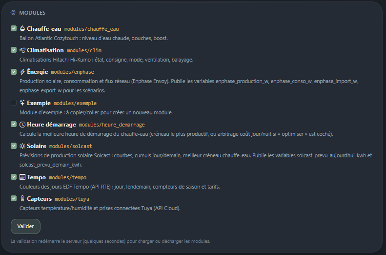

[← Sommaire](README.md)

# 6. Créer un module

Un module est un répertoire de `modules/`. Le socle ne connaît rien de son
contenu : il lit son `conf.py`, et appelle les points d'entrée que le module
déclare. Ajouter une capacité à l'application ne demande donc **aucune
modification du socle**.

## Structure

```
modules/mon_module/
├── __init__.py
├── conf.py                     manifest — le seul fichier obligatoire
├── fonctions/
│   ├── __init__.py
│   ├── api.py                  dialogue avec l'appareil ou l'API
│   ├── info.py                 lectures exposées aux scénarios (INFOS)
│   ├── scenario.py             actions exposées aux scénarios (SCENARIO)
│   └── affichage.py            construction des graphiques (optionnel)
├── onglet/
│   ├── __init__.py
│   └── views.py                fonction onglet(request)
├── dashboard/
│   ├── __init__.py
│   └── views.py                fonction bloc(request) ou blocs(request)
└── templates/mon_module/
    ├── onglet.html
    └── _bloc.html
```

Seul `conf.py` est obligatoire. Un module peut n'avoir qu'un onglet, ou
qu'un bloc de tableau de bord, ou ni l'un ni l'autre (le module Heure de
démarrage est essentiellement un module de calcul).

Le plus simple est de **copier `modules/exemple/`** et de le renommer.

## 1. Le manifest — `conf.py`

```python
"""Manifest du module Mon Module."""

ONGLET = "Mon module"          # obligatoire : nom de l'onglet
ICONE = "thermometer-half"     # nom Bootstrap Icons
DESCRIPTION = "Ce que fait ce module, en une phrase."

# Tâches de fond, exécutées par le scheduler du socle
TACHES = [
    {"nom": "actualiser", "fonction": "fonctions.api.tache_actualiser", "minutes": 10},
]

# Actions proposées dans l'éditeur de scénarios
SCENARIO = [
    {"nom": "allumer", "fonction": "fonctions.scenario.allumer",
     "description": "Allume l'appareil"},
]

# Lectures proposées en condition et en « Info → variable »
INFOS = [
    {"nom": "temperature", "fonction": "fonctions.info.temperature",
     "description": "Température mesurée (°C)"},
]
```

`ONGLET` sert de libellé d'onglet, `ICONE` doit être un nom de
[Bootstrap Icons](https://icons.getbootstrap.com) **sans le préfixe `bi-`**.

Le détail de chaque contrat est en
[Référence des contrats](07-reference-contrats.md).

## 2. L'onglet — `onglet/views.py`

Le socle appelle la fonction `onglet(request)` quand on clique sur l'onglet.
C'est une vue Django ordinaire.

```python
from django.shortcuts import render

from core.services import get_setting, journal

from ..fonctions import api


def onglet(request):
    if request.method == "POST" and request.POST.get("action") == "params":
        # enregistrer le paramétrage saisi
        ...

    return render(request, "mon_module/onglet.html", {
        "active_tab": "module:mon_module",   # met l'onglet en surbrillance
        "mesure": api.lire(),
    })
```

`active_tab` doit valoir `"module:<nom_du_repertoire>"` pour que l'onglet
apparaisse actif dans la barre de navigation.

## 3. Le bloc de tableau de bord — `dashboard/views.py`

Deux contrats possibles :

```python
from django.template.loader import render_to_string

from ..fonctions import api


def bloc(request):
    """Un seul bloc : retourne du HTML (ou une chaîne vide pour n'afficher
    aucun bloc)."""
    return render_to_string("mon_module/_bloc.html", {"mesure": api.lire()})
```

```python
def blocs(request):
    """Plusieurs blocs : liste de dictionnaires."""
    return [
        {"titre": "Vue directe", "icone": "speedometer", "html": "<p>…</p>"},
        {"titre": "La journée", "icone": "calendar", "html": "<p>…</p>"},
    ]
```

Le socle encadre déjà le bloc dans une carte avec son titre : le module ne
fournit que le contenu.

Une exception levée dans un bloc n'empêche pas le tableau de bord de
s'afficher : elle est journalisée et le bloc est ignoré.

## 4. Les services du socle

```python
from core.services import (
    journal, get_setting, set_setting,
    get_variable, set_variable, set_control_state,
)

journal("Chauffe démarrée", module="mon_module")
set_setting("api_key", "xxx", module="mon_module", secret=True)
get_setting("api_key", module="mon_module", default="")
set_variable("mon_module_temperature", "21.5")
```

- **Réglages** (`get_setting` / `set_setting`) : la configuration du module,
  cloisonnée par `module=`. `secret=True` masque la valeur dans l'interface.
- **Variables** (`get_variable` / `set_variable`) : les valeurs publiques,
  partagées avec les scénarios et les autres modules.
- **Journal** (`journal`) : niveau `INFO` par défaut, `LogEntry.WARNING` ou
  `LogEntry.ERROR` pour le reste.

## 5. Associer le module au socle

1. Placer le répertoire dans `modules/`.
2. Onglet **Configuration** → section **Modules** → cocher le module →
   **Valider**.
3. Le serveur redémarre : l'onglet apparaît, le bloc aussi, les tâches sont
   enregistrées et les fonctions déclarées deviennent disponibles dans
   l'éditeur de scénarios.



Un module activé devient une **app Django à part entière** : il peut avoir
ses templates, ses modèles et ses migrations.

## 6. Vérifier

| À vérifier | Où |
| --- | --- |
| Le module est détecté | Configuration → Modules |
| L'onglet s'affiche | barre de navigation |
| Le bloc s'affiche | Tableau de bord |
| Les tâches sont enregistrées | Configuration → Scheduler |
| Les actions et infos sont proposées | éditeur de scénario |
| Aucune erreur | Journal, filtré sur le module |

## Erreurs fréquentes

- **`conf.py` invalide** — le module reste listé avec son message d'erreur.
  Attention aux imports au niveau du fichier : `conf.py` est chargé très
  tôt, un import lourd ou qui échoue casse la détection. Les modules livrés
  encadrent leurs imports dynamiques d'un `try/except`.
- **Onglet inactif dans la barre** — `active_tab` mal renseigné.
- **Template introuvable** — les templates doivent être dans
  `modules/<nom>/templates/<nom>/`, le sous-répertoire au nom du module
  évite les collisions entre modules.
- **Une tâche ne tourne pas** — vérifier la carte Scheduler, et que le
  chemin `fonction` est relatif au répertoire du module
  (`fonctions.api.tache_actualiser`, sans `modules.<nom>.` devant).
- **Un module désactivé reste dans la barre** — le redémarrage n'a pas eu
  lieu ; relancer `runserver`.
